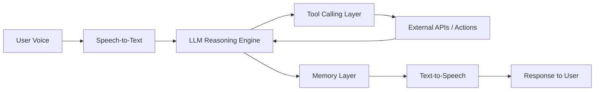
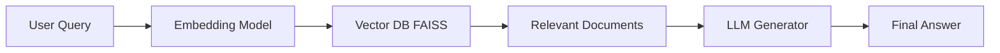
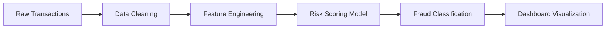

# Hey there, I'm Poornesh Gorrela 👋  

### 🚀 AI Platform Engineer · 🤖 Agentic AI · 📊 Data & Product Systems  

  

---

# ⚡ What Makes Me Different

- I build **end-to-end intelligent systems**
- I combine **AI + Data + Product thinking**
- I focus on **real-world scalable systems**
- I design **architecture, not just models**

---

# 🚀 Featured Systems

---

## 🤖 Agentic AI Voice Assistant  

👉 Multi-Agent AI System with Real-Time Orchestration  

### 🧠 Architecture (Visual)

### 🎥 Demo

  

### ⚙️ How It Works Internally
- Converts voice → text using STT  
- LLM performs **multi-step reasoning**  
- Dynamically calls tools (APIs / functions)  
- Maintains **context memory across interactions**  
- Converts response → speech  

### 🚀 What I Built
- Multi-agent orchestration  
- Tool-calling pipelines  
- Real-time AI interaction loop  

  

---

## 🧠 Medical RAG Assistant  

👉 Production-Ready Retrieval-Augmented Generation System  

### 🧠 Architecture

### 🎥 Demo

  

### ⚙️ How It Works Internally
- Converts query into embeddings  
- Searches FAISS vector DB  
- Retrieves top-k relevant chunks  
- Feeds context into LLM  
- Generates grounded response  

### 📈 Impact
- +30% retrieval accuracy  
- Reduced hallucinations  

  

---

## 💰 Fraud Detection Analytics System  

👉 Financial Risk Intelligence Platform  

### 🧠 Architecture

### 🎥 Demo

  

### ⚙️ How It Works Internally
- SQL + Python pipelines process transactions  
- Feature engineering extracts behavioral signals  
- Risk scoring assigns fraud probability  
- Dashboard visualizes anomalies  

### 🚀 What I Built
- Data pipelines  
- Risk scoring system  
- Streamlit dashboard  

  

---

## 🎬 Pitch Visualizer  

👉 LLM Orchestration System  

### ⚙️ How It Works
- Splits text into scenes  
- Enhances prompts using LLM  
- Generates visuals via APIs  
- Handles failures gracefully  

  

---

## 💬 Empathy Engine  

👉 Emotion-Aware AI System  

### ⚙️ How It Works
- Sentiment detection (VADER)  
- Emotion intensity calculation  
- Dynamic speech modulation  

  

---

## 👕 TokiTide — AI Personalization Platform  

👉 Full-Stack AI Product  

### 🎥 Demo

  

### ⚙️ What It Does
- Converts user input → personalized designs  
- Uses AI pipelines for generation  
- Full product lifecycle implementation  

  

---

# ⚙️ Tech Stack

  

---

# 📊 GitHub Stats

  
  

---

# 🌍 Connect With Me

- 📧 Email: pavansaipoornesh99@gmail.com  
- 💼 LinkedIn: https://www.linkedin.com/in/poornesh-pavan-sai-gorrela-8156a2252  
- 🧠 GitHub: https://github.com/ppspoornesh  

---

> ⚡ I build systems, not just projects.
