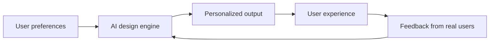
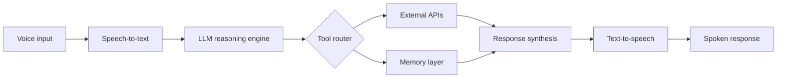
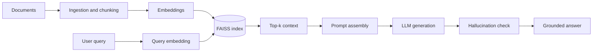
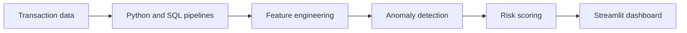

# Poornesh Gorrela

**AI Engineer. LLM systems, RAG, agents, and voice.**

I build AI systems that hold up in production: retrieval that stays grounded, agents that call tools reliably, and APIs that stay fast under load.

---

## About

I work on the layer between a model and a product: the retrieval pipelines, orchestration logic, evaluation, and services that decide whether an LLM feature is actually usable.

At **Darwix AI** I work on agentic AI pipelines, RAG systems, and FastAPI services deployed on AWS and Docker. Outside work I build and ship my own products end to end, including **TokiTide**, a live AI platform with real users.

Things I care about:

- Cutting hallucinations with retrieval quality and evaluation, not just prompt tweaks
- Agents that fail gracefully: fallbacks, retries, and clear tool boundaries
- Latency as a product feature, especially for voice
- Shipping the whole thing, from architecture to deployment

---

## Selected work

### TokiTide: AI personalization platform

Live at [tokitide.xyz](https://tokitide.xyz). A full-stack product that turns user preferences into personalized AI-generated designs, with a feedback loop from real usage back into product decisions.

```mermaid
flowchart LR
    A[User preferences] --> B[AI design engine]
    B --> C[Personalized output]
    C --> D[User experience]
    D --> E[Feedback from real users]
    E --> B
```

**Why it matters:** this is the project where I owned everything, from product logic and model integration to deployment and iteration.

[Visit the live product](https://tokitide.xyz)

---

### Agentic voice assistant

A multi-agent voice system with dynamic tool routing and a persistent memory layer, built for a real-time conversational loop.

```mermaid
flowchart LR
    A[Voice input] --> B[Speech-to-text]
    B --> C[LLM reasoning engine]
    C --> D{Tool router}
    D --> E[External APIs]
    D --> F[Memory layer]
    E --> G[Response synthesis]
    F --> G
    G --> H[Text-to-speech]
    H --> I[Spoken response]
```

**Focus:** keeping the loop responsive while the agent decides which tool to call and what context to inject.

[Watch the demo](https://www.youtube.com/watch?v=pbH4afMm47g)

---

### Medical RAG assistant

A retrieval-augmented question answering pipeline for medical content, with an evaluation layer that checks generated answers against retrieved context.

```mermaid
flowchart LR
    A[Documents] --> B[Ingestion and chunking]
    B --> C[Embeddings]
    C --> D[(FAISS index)]
    Q[User query] --> E[Query embedding]
    E --> D
    D --> F[Top-k context]
    F --> G[Prompt assembly]
    G --> H[LLM generation]
    H --> I[Hallucination check]
    I --> J[Grounded answer]
```

**Result:** 30% improvement in retrieval accuracy over the baseline setup.

[Watch the demo](https://www.youtube.com/watch?v=qmS9I-KiB28)

---

### Fraud detection analytics platform

Transaction data goes through SQL and Python pipelines, feature engineering, and anomaly detection, then surfaces as a risk score on a monitoring dashboard.

```mermaid
flowchart LR
    A[Transaction data] --> B[Python and SQL pipelines]
    B --> C[Feature engineering]
    C --> D[Anomaly detection]
    D --> E[Risk scoring]
    E --> F[Streamlit dashboard]
```

[View the repository](https://github.com/ppspoornesh/fraud-detection-analytics-system)

---

### Smaller projects

| Project | What it does | Repo |
|---|---|---|
| Pitch Visualizer | Turns a text brief into visual scenes through an LLM pipeline, with fallback handling when upstream APIs fail | [pitch-visualizer](https://github.com/ppspoornesh/pitch-visualizer) |
| Empathy Engine | Runs VADER sentiment analysis on text and adjusts tone, pitch, and intensity of the generated speech | [empathy-engine](https://github.com/ppspoornesh/empathy-engine) |

---

## Experience

**AI / ML Engineer Intern, Darwix AI** (Gurugram)

- Designed agentic AI pipelines with multi-step reasoning and tool orchestration
- Built RAG systems on FAISS vector search, with a focus on reducing hallucinations
- Developed FastAPI microservices to serve AI features at production latency
- Deployed AI workloads on AWS with Docker

---

## Tech stack

| Area | Tools |
|---|---|
| LLMs and GenAI | OpenAI, Claude, Gemini, LangChain, LlamaIndex, Hugging Face |
| Agentic AI | Multi-agent systems, tool calling, RAG, memory layers, prompt engineering |
| ML and data | PyTorch, scikit-learn, Pandas, NumPy, FAISS, feature engineering |
| Backend | FastAPI, Flask, REST, WebSockets, microservices |
| Storage | PostgreSQL, MongoDB, Redis, vector databases |
| Cloud and DevOps | AWS, Docker, Git, CI/CD |
| Visualization | Streamlit, Plotly, Matplotlib |

---

## Currently

| Building | Learning | Looking for |
|---|---|---|
| Agentic systems with real-time LLM orchestration | Multi-agent frameworks | Full-time AI, ML, or backend roles |
| AI product platforms | LLM evaluation techniques | Small, fast-moving teams that ship |
| Voice AI pipelines | MLOps and model observability | Product-minded engineering teams |

---

## GitHub activity

&nbsp;

<picture>
  <source media="(prefers-color-scheme: dark)" srcset="https://raw.githubusercontent.com/ppspoornesh/ppspoornesh/output/github-snake-dark.svg"/>
  <source media="(prefers-color-scheme: light)" srcset="https://raw.githubusercontent.com/ppspoornesh/ppspoornesh/output/github-snake.svg"/>
  
</picture>

---

## Contact

Happy to talk about AI architecture, system design, or roles.

[LinkedIn](https://www.linkedin.com/in/poornesh-pavan-sai-gorrela-8156a2252) | [GitHub](https://github.com/ppspoornesh) | [Email](mailto:pavansaipoornesh99@gmail.com) | [TokiTide](https://tokitide.xyz)

I build systems that think, act, and scale.

